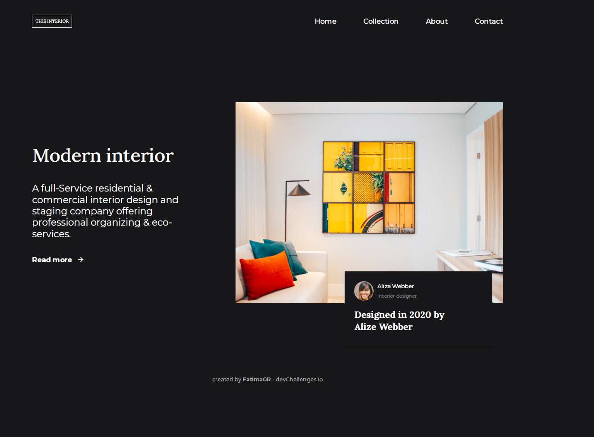

<!-- Please update value in the {}  -->

<h1 align="center">Interior consultant</h1>

   Solution for a challenge from  <a href="http://devchallenges.io" target="_blank">Devchallenges.io</a>.

  <h3>
    <a href="https://{your-demo-link.your-domain}">
      Demo
    </a>
     | 
    <a href="https://github.com/FatimaGR/Interior-consultant-solution">
      Solution
    </a>
     | 
    <a href="https://devchallenges.io/challenges/Jymh2b2FyebRTUljkNcb">
      Challenge
    </a>
  </h3>

<!-- OVERVIEW -->
## Overview

### The challenge

Create a homepage following the design. The page should be responsive. Don’t look at the existing solution. Fulfill user stories below:

- User story: I can see a page following the given design
- User story: On mobile, I can see a collapsed navigation
- User story: On mobile, when I select the hamburger menu, I can see a navigation

### Built With

- HTML
- CSS

<!-- THE CHALLENGE -->
## Contact

- Website [Fatima Gallardo](https://porfolio-website-gules.vercel.app)
- GitHub [@FatimaGR](https://github.com/FatimaGR)
- Dev challenges - [@FatimaGR](https://devchallenges.io/portfolio/FatimaGR)
